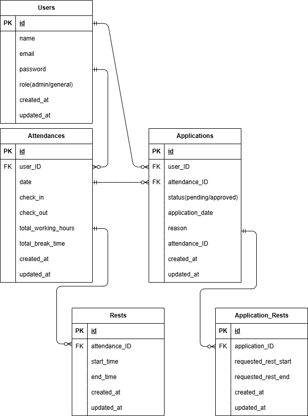

# アプリ名
take-work-manager
## 環境構築
リポジトリからダウンロード
```
git clone git@github.com:crosswoods4096-tech/take-work_manager.git
```
srcディレクトリの「.env.example」をコピーして「.env」を作成し、DBの設定を変更
```
cp .env.example .env
```
```
DB_CONNECTION=mysql
DB_HOST=mysql
DB_PORT=3306
DB_DATABASE=laravel_db
DB_USERNAME=laravel_user
DB_PASSWORD=laravel_pass
```
dockerコンテナを構築
```
docker-compose up -d --build
```
phpコンテナにログインしてLaravelをインストール
```
docker-compose exec php bash
composer install
```
アプリケーションキーを作成
```
php artisan key:generate
```
DBのテーブルを作成
```
php artisan migrate
```
DBのテーブルにダミーデータを投入
```
php artisan db:seed
```
画像アップロード用のシンボリックリンク作成
```
php artisan storage:link
```
storageディレクトリの書き込み権限を設定
```
chmod -R 777 storage
```
## 開発環境

・ユーザー登録画面：http://localhost/register  
・ログイン画面：http://localhost/login
・管理者ログイン画面：http://localhost/admin/login  
・勤怠管理画面：http://localhost/

## ER図



## テストプログラム環境構築
テスト用データベースの作成

```
mysql -u root -p
```

コマンドでルート権限でmysqlにログインし、

```
CREATE DATABASE demo_test;
```

コマンドでdemo_testというテスト用データベースを作成します。


テスト用.envファイルの作成

phpコンテナにログインし、

```
cp .env .env.testing
```

コマンドで.envファイルをコピーしたenv.testingというファイルを作成します。

ファイルの作成ができたら文頭部分のAPP_ENVをTESTにAPP_KEYを空白にします。

次にenv.testingにテスト用のデータベースの接続情報を加えます。

具体的にはDB_DATABASEをdemo_testDB_USERNAMEおよびDB_PASSWORDをrootに変更します。

次に先ほど空にしたAPP_KEYに新たなテスト用のアプリケーションキーを加えるためphpコンテナ内で下記のコマンドを実行します。

```
php artisan key:generate --env=testing
```

　次に、マイグレーションコマンドを実行して、テスト用のテーブルを作成します。コマンドは以下です。

```
php artisan migrate --env=testing
```

以上でテストプログラムを動作するための環境作成は終了です。

PHPコンテナ内で以下のコマンドを実行します。

```
php artisan test
```

各テストの成否が表示されます。


## 使用技術
```
PHP 8.1.34
Laravel Framework 8.83.8   
Composer version 2.9.3  
mysql:8.0.26   
nginx:1.21.1
```
